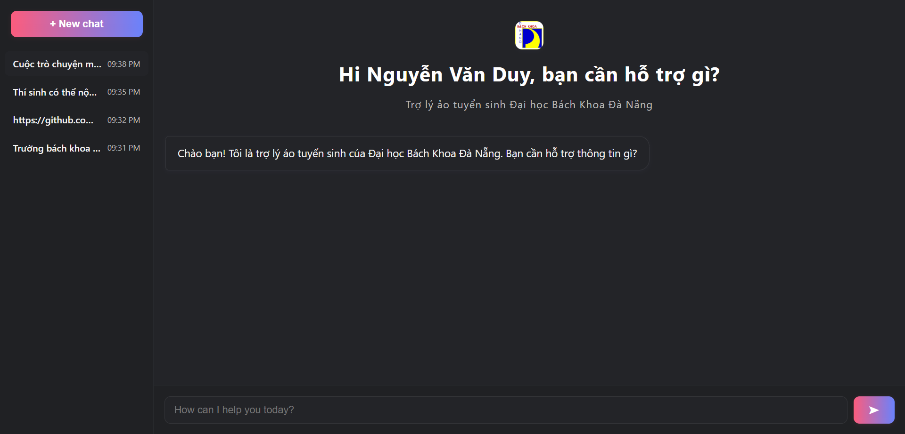

# Chat Box Đại học Bách Khoa Đà Nẵng

Dự án này xây dựng một hệ thống chat box (trợ lý ảo) hỗ trợ tuyển sinh cho Đại học Bách Khoa - Đại học Đà Nẵng. Chat box giúp thí sinh, phụ huynh và người quan tâm dễ dàng tra cứu thông tin về tuyển sinh, ngành học, quy chế, thủ tục, v.v.

> **Lưu ý:** Dự án này được thực hiện với mục đích demo, sử dụng dữ liệu có sẵn, không dùng cho mục đích thương mại.

## Ảnh demo



Bạn có thể xem video demo trên YouTube tại: [link demo YouTube](<điền_link_youtube_của_bạn_vào_đây>)

## Tính năng chính

- Giao diện chat hiện đại, thân thiện, đa nền tảng.
- Lưu lịch sử các cuộc trò chuyện, cho phép chuyển đổi nhanh giữa các phiên chat.
- Trả lời tự động các câu hỏi liên quan đến tuyển sinh, ngành học, quy định, học phí, học bổng, v.v.
- Tích hợp AI để nâng cao chất lượng trả lời.
- Dễ dàng mở rộng, tích hợp thêm dữ liệu hoặc chức năng mới.

## Kiến trúc dự án

- **Frontend:** ReactJS (thư mục `chat-ui`)
- **Backend:** FastAPI, AI/ML (thư mục `bk_rag`)

## Hướng dẫn cài đặt & chạy thử

### 1. Chuẩn bị môi trường

- Cài đặt Node.js (>=14) và Python (>=3.8)
- Clone repository về máy

### 2. Cài đặt backend

```bash
cd bk_rag
python -m venv venv
source venv/bin/activate  # hoặc .\venv\Scripts\activate trên Windows
pip install -r requirements.txt
uvicorn main:app --reload
```

### 3. Cài đặt frontend

```bash
cd chat-ui
npm install
npm start
```

- Truy cập giao diện tại: [http://localhost:3000](http://localhost:3000)

---

Cảm ơn bạn đã quan tâm đến dự án! Nếu có góp ý hoặc câu hỏi, hãy liên hệ với nhóm phát triển hoặc để lại bình luận tại repository này.


